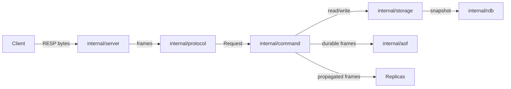

# Architecture overview

This repository implements a Redis-compatible TCP server in Go one phase at a time. It now includes the TCP server, RESP parsing and encoding, sharded in-memory storage, transactions, pub/sub, replication, RDB snapshots, append-only-file durability, memory-pressure eviction, and basic operational metrics. Each package keeps a distinct responsibility so later phases can extend the server without mixing those concerns.

For domain vocabulary, see [`GLOSSARY.md`](../../GLOSSARY.md) at the repository root.

## Request flow

## Package layout

### `cmd/stash`

Contains the `main` package and the production binary entrypoint. It is responsible for:

- parsing runtime flags
- creating the logger, store, command executor, and TCP server
- starting the server with signal-aware shutdown

### `internal/config`

Holds startup configuration such as host, port, log level, TTL eviction settings, persistence paths, replication/auth settings, `maxmemory`, and slowlog threshold. Every flag is documented in the [configuration reference](../reference/configuration.md).

### `internal/logger`

Provides a small `log/slog` initializer so the whole server shares one structured logging setup.

### `internal/aof`

Owns append-only-file durability.

Current responsibilities:

- replay RESP command streams on startup before the listener opens
- append successful mutating commands in RESP form
- apply `appendfsync` policies (`always`, `everysec`, `no`)
- rewrite the current durable state in the background for `BGREWRITEAOF`
- write a snapshot of the keyspace into a missing or empty file (`SeedFile`), or the file a symbolic link at the path leads to, by the same temp-file, fsync and rename steps as the rewrite

### `internal/protocol`

Owns RESP parsing and encoding.

Current responsibilities:

- parse RESP2 frames from a buffered TCP reader
- decode RESP frames incrementally from byte buffers without blocking, reporting incomplete frames distinctly from protocol errors
- handle fragmented bulk strings and arrays correctly
- encode simple strings, errors, integers, bulk strings, and arrays
- include minimal RESP3 placeholder types (`Boolean`, `Null`) for future expansion

### `internal/storage`

Owns the in-memory key/value store.

Current responsibilities:

- route keys to a fixed shard set and protect each shard with its own `sync.RWMutex`
- support strings, hashes, lists, sets, sorted sets, and streams through a unified value model
- store TTLs in Unix milliseconds
- perform passive eviction when a read or write touches an expired key
- perform active eviction in a background loop, and again when an accounted write re-measures the keyspace (the first one after a TTL deadline has passed), reporting the keys either sweep removed through one expiration listener so the server can replicate and persist those deletions
- track approximate keyspace memory when `maxmemory` is enabled
- evict sampled least-recently-used candidates under memory pressure
- scan several sorted-set score ranges under one lock acquisition, so `GEORADIUS` reads only the geohash cells that cover its radius, plus two guard ranges for scores outside every cell, instead of the whole set

### `internal/command`

Translates RESP arrays into executable requests and dispatches them to handlers.

Implemented commands cover strings, bitmaps, HyperLogLog, hashes, lists, sets, sorted sets, geospatial data, streams, transactions, pub/sub, replication handshakes, `WAIT`, `BGREWRITEAOF`, `INFO`, `SLOWLOG`, and `MONITOR`. The `commandSpecs` table registers each command with its handler, argument validator, and replication and durability flags. The [command reference](../reference/commands.md) documents that table for users.

### `internal/server`

Owns the TCP lifecycle.

Current responsibilities:

- create the listener with `net.Listen`
- accept client connections in a loop
- spawn one goroutine per client (default networking mode), which queues each reply and sends the queue just before it would wait for more input, so a client that pipelines requests gets its replies in as few writes as the requests arrived in
- parse → execute → respond for each request
- answer a request it cannot parse with one error and close the connection, because the byte stream cannot be resynchronized (both networking modes)
- close a connection that has not authenticated within `--auth-timeout` when a password is required (a read deadline in the default mode, a timer that asks the loop to close in event-loop mode)
- hold a client that has not authenticated to small frames (arrays of at most 10 elements, bulk strings of at most 16 KiB) when a password is required; in event-loop mode the connection decodes one request at a time until then, so a request behind an `AUTH` is decoded under the limits in force after it
- provide a non-blocking connection state machine that buffers reads, parses complete requests, buffers responses, and flushes output incrementally
- optionally serve all clients from one event-loop goroutine driven by OS readiness notifications (`--event-loop`), dispatching readable and writable sockets through per-connection state machines
- maintain an active connection registry for shutdown
- load startup persistence (RDB and/or AOF) before accepting TCP connections, and write the keys an RDB snapshot loaded into a missing or empty AOF before opening it, since every later start loads the AOF and skips the RDB snapshot
- append durable command frames and fan out replication writes after successful execution
- maintain monitor and slowlog registries for operational visibility
- expose server stats used by `INFO`
- stop cleanly when the process receives `SIGINT` or `SIGTERM`; a second signal ends the process immediately with the default action, which abandons a shutdown that is stuck
- stop, returning the error, when the accept loop fails with an error that is not temporary; a Replica's link to its Master ends with the server

### `test`

Contains integration tests that verify the server end to end over a real TCP connection.

## Design notes

### Why shard-local store locks?

The store now uses a fixed shard set with one `sync.RWMutex` per shard. Single-key commands only lock the owning shard, while multi-key commands group keys by shard and lock shard IDs in deterministic order to avoid deadlocks.

### Why RESP3 placeholders now?

The user requested RESP3-aware structure, but full RESP3 support is out of scope for the current implementation. The protocol package therefore exposes lightweight placeholder types so later expansion does not require redesigning the core abstraction.

### Why an opt-in event loop?

The `--event-loop` flag replaces goroutine-per-connection networking with a single event-loop goroutine backed by OS I/O multiplexing, so many idle connections cost file descriptors instead of goroutine stacks.

Platform support is limited to the following systems:

- Linux uses `epoll` and macOS uses `kqueue`, both through the standard-library `syscall` package with level-triggered readiness.
- Every other platform (including Windows) logs a warning and falls back to the default goroutine-per-connection path, so the flag is safe to set everywhere.

Inside the loop, each accepted socket is non-blocking and belongs to a connection state machine. Readable sockets feed buffered bytes into request parsing and command execution. Writable sockets flush pending RESP output under backpressure. Other connections can produce pub/sub messages, monitor events, and replication payloads. A locked push queue for each connection and a poller wakeup pass these deliveries to the loop, which orders all socket writes through the state machine's single write buffer. Before running each of a connection's requests, the loop moves that connection's waiting deliveries into its write buffer, so a message published before the request reaches the client ahead of the reply, as in Redis; one delivered while the request runs follows the reply.

The event loop executes one request at a time and interleaves output flushes. It pauses reads and execution when a connection's buffered output passes a high-water mark, then resumes when the socket drains. Output that nobody asked for is capped. A client that receives pub/sub messages or monitor events is disconnected once 32 MiB of them are waiting for it (a replica gets 256 MiB, as in Redis), and all such clients together may hold 128 MiB: past that, the loop closes the one with the most waiting until the total fits, so fanning a message out to many slow subscribers cannot multiply memory. Replies to a client's own requests are not subject to these caps, because a reply can be as large as a stored value; only the 512 MiB per-connection limit applies to them. These caps replace the per-write deadlines that the goroutine path applies to pub/sub and monitor deliveries. When a peer half-closes, the server finishes the parsed pipeline and flushes its replies before closing the connection.

Commands execute inline on the loop goroutine. In event-loop mode, a command that would block, such as `BLPOP` on an empty list or `WAIT` for pending replica acknowledgements, returns an explicit error instead of stalling every connection. Immediately satisfiable forms still succeed. The goroutine-per-connection path remains the default.

### Why order writes and transactions explicitly?

The sharded store makes each operation atomic, but two clients' operations can still interleave. Two things depend on their order: `EXEC`, which must see its watched keys unchanged and its queued commands run without others in between, and the AOF and replicas, which must see two writes to one key in the order they were applied.

The command executor therefore has a sequencer. Every request holds a read-write lock shared while it executes; `EXEC` holds it exclusive. A request that writes also holds the lock for the stripe (one of 64) of each key it writes, from before it executes until its frames have been appended to the AOF and handed to the replicas. Writers to different keys still run in parallel; writers to the same key, and any write whose keys the command table does not declare, are ordered. The expiry sweep and the snapshot an AOF rewrite takes hold every stripe for a moment, so that an expiry and a later write of the same key, or a snapshot and a command halfway to the log, cannot be reordered. When there is no AOF and no replica there is nothing to order, and the stripes are skipped.

A blocking command (`BLPOP`, `WAIT`) waits with nothing held and takes the locks only for each attempt; inside a transaction it does not wait at all.

### Why keep persistence separate from replication?

Replication and AOF both reuse RESP-encoded command frames, but they serve different correctness goals:

- replication forwards commands to live replicas
- AOF records only durable state mutations for crash recovery

Keeping those paths separate lets the server replicate transient commands like `PUBLISH` without persisting them, while still logging durable commands such as `XADD` even when they are not part of the replication handshake flow.
